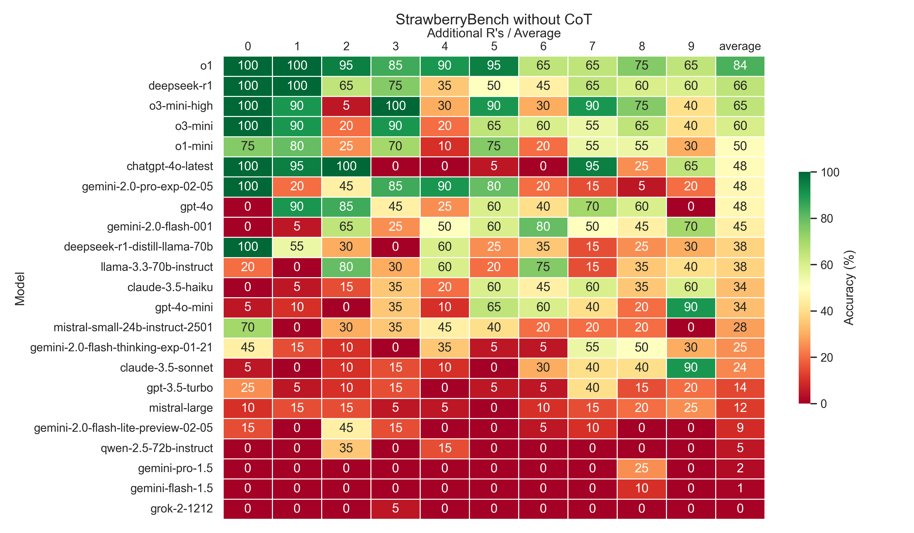
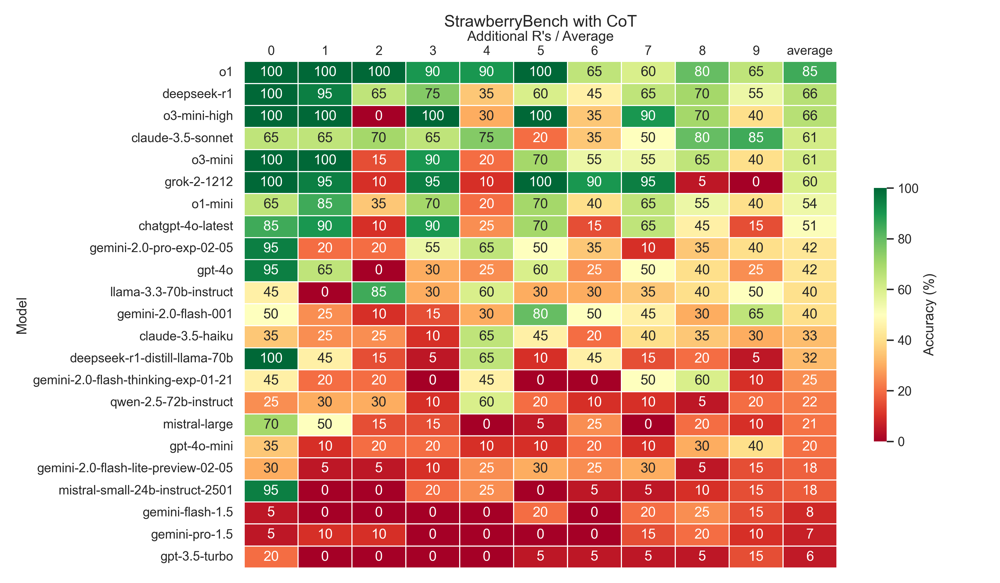
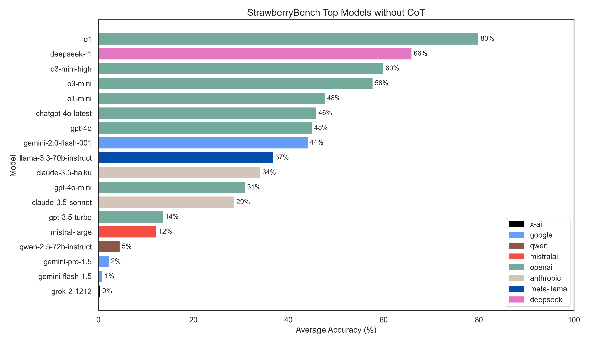
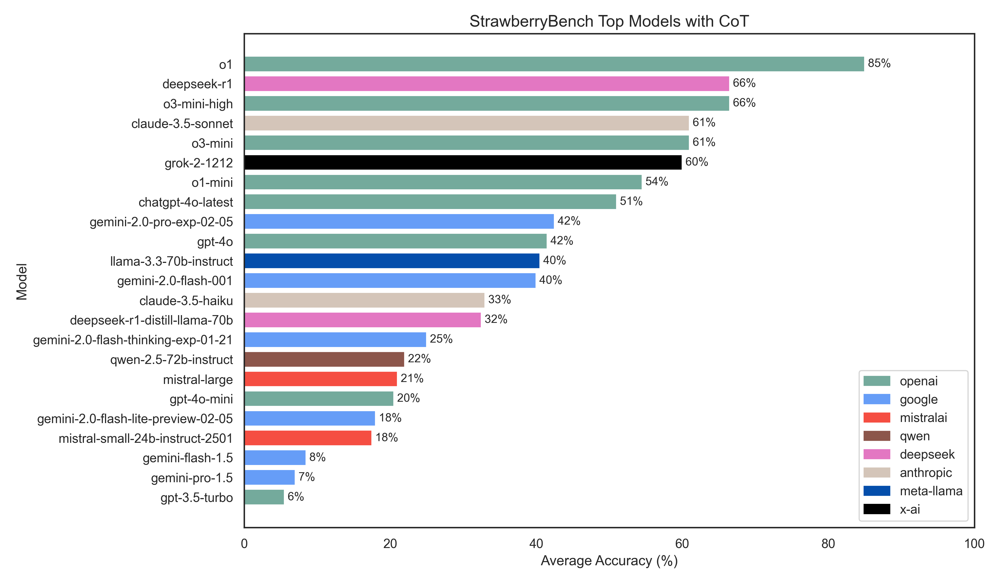

# 🍓🍓🍓 StrawberryBench 🍓🍓🍓

StrawberryBench evaluates language models on a basic reasoning task: counting the `r` characters in a word `strawberry`.

While AI models excel at complex tasks, this benchmark highlights gaps in fundamental processing, revealing areas for improvement even as models approach saturation in other benchmarks.

## 🍓 Rationale

- Easy for humans but surprisingly challenging for LLMs.
- Reveals qualitative differences between human and AI language processing.
- Explores key concepts: tokenization, attention, syntax vs. semantics, chain-of-thought, etc.
- Binary evaluation: answers are either correct or incorrect.
- Designed to be extendable, scalable, and adaptable.
- Simple to implement.

## 🍓 Methodology

- Task prompt: `How many r's are in '[word]'?`.
- Output format: `<answer>[number]</answer>`.
- Optional CoT prompt: `Think step by step`.
- Extra `r` characters added to increase difficulty.
- Each variant tested `20` times for statistical significance.
- Formatting errors count as incorrect answers.
- Temperature fixed at `1.0`

## 🍓 Results (2025-02-17)






## 🍓 Observations

- Reasoning models dominate the benchmark.
- Chain-of-thought boosts performance in non-reasoning models.
- Many models applied CoT without explicit prompting (GPT-4o+, Gemini 2.0 Flash, Claude, Mistral, Llama).
- Models that skipped CoT and gave direct answers performed the worst (Gemini 1.5 Flash/Pro, Grok 2, Qwen 2.5).
- StrawberryBench results align with other public benchmarks.
  
---

- OpenAI's o1 leads by a wide margin.
- DeepSeek's r1 results are impressive given its open-source nature and cost.
- Google made major gains from Gemini 1.5 Flash to 2.0 Flash.
- Grok 2 and Claude 3.5 Sonnet saw the biggest CoT improvements.
- Grok 2 occasionally hallucinated absurdly long reasoning chains with 200–300 `r`'s.

## 🍓 Criticism

- _"This doesn't test real intelligence"_
  - It evaluates how models process information, reason, and follow instructions - key aspects of intelligence.
- _"Just prompt better or use tools"_
  - A strong model should generalize well and perform without excessive hand-holding.
- _"This is just a tokenization issue"_
  - Large-scale character-level models are impractical.
- _"Strict formatting rules are unfair"_
    - A model that can't follow formatting risks failure in other tasks.
- _"Every model fails, so why test?"_
  - New models are improving, and benchmarks track progress in reasoning capabilities.
- _"This distracts from bigger AI progress"_
  - Progress in science and engineering often comes from obsessing over what's not working.

## 🍓 Prerequisites

- Python 3.x
- OpenRouter API key

## 🍓 Installation

1. **Clone the repository:**

```bash
git clone https://github.com/iuriialekseev/StrawberryBench.git
cd StrawberryBench
```

2. **Install dependencies:**

```bash
python -m venv venv

# source ./venv/bin/activate

pip install -r requirements.txt
```

3. **Set your API key:**

StrawberryBench uses the OpenRouter API. Set your API key as an environment variable:
```bash
export OPENROUTER_API_KEY="your_openrouter_api_key_here"
```

## 🍓 Configuration

Edit the `config.py` file to customize your benchmark settings.

## 🍓 Usage

1. **Run the benchmark:**

```bash
python benchmark.py
```
This script generates prompts, queries the models asynchronously, aggregates the results, and outputs them.

2. **Generate plots:**

```bash
python plot.py
```

## 🍓 Contributing

Contributions, bug reports, and feature requests are welcome!

Feel free to open an issue or submit a pull request.
