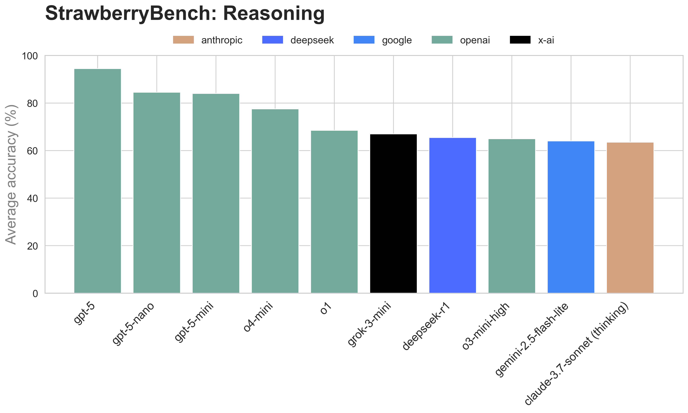
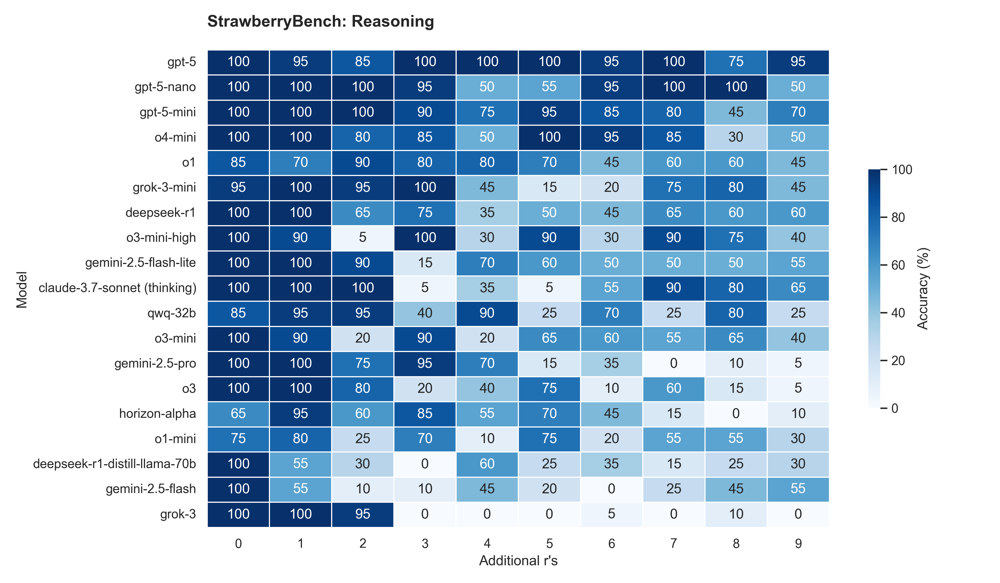
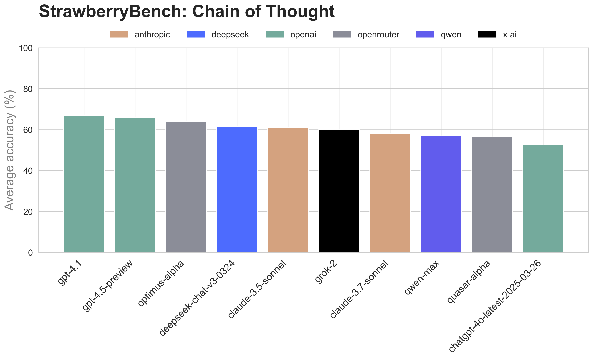
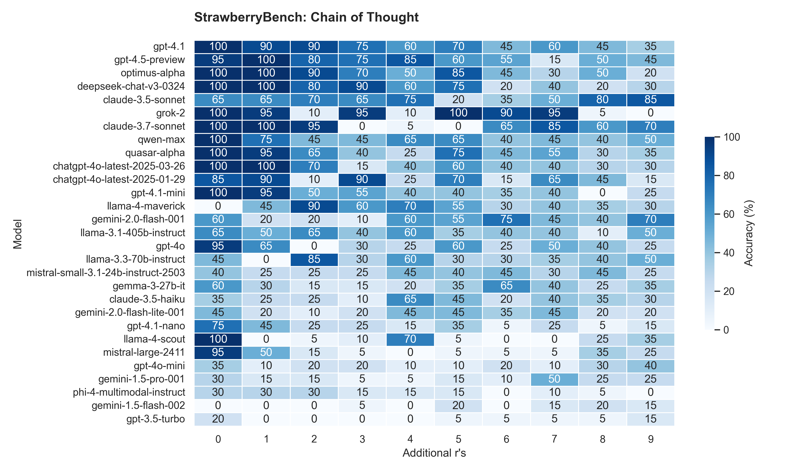
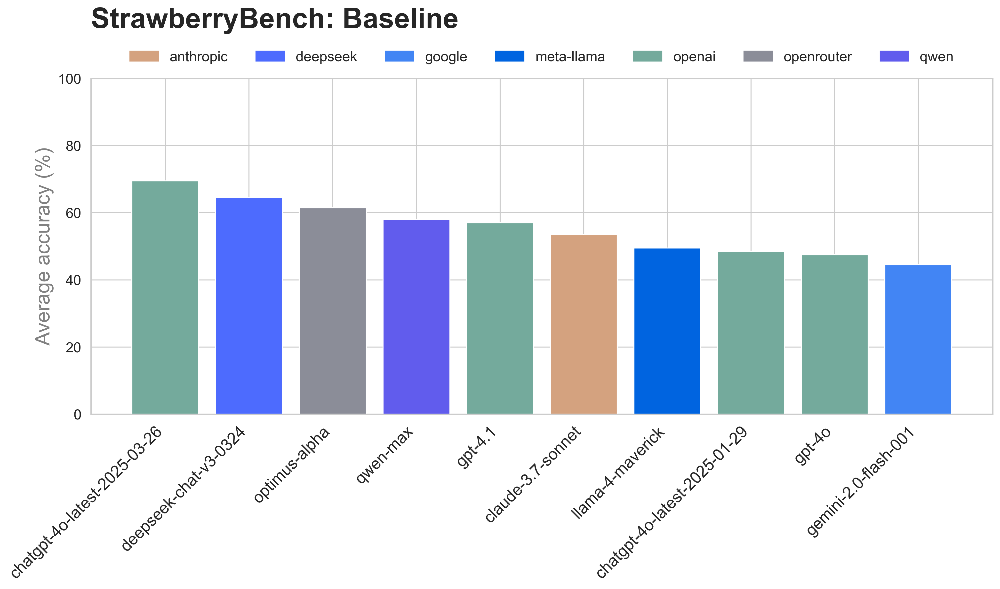
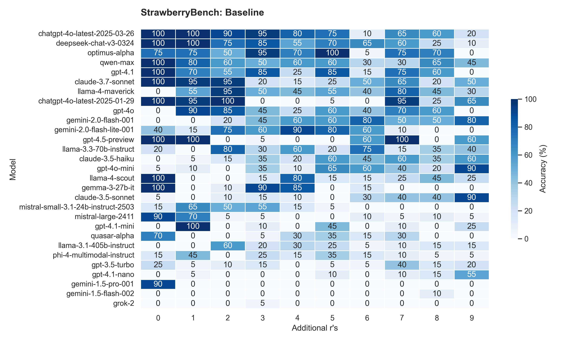

# 🍓 StrawberryBench

StrawberryBench is a deceptively simple benchmark designed to test language models on a basic task: counting the number of `r`s in the word `strawberry`.

It reveals weaknesses in reasoning capabilities, highlighting areas for improvement, even as models approach saturation on other complex public benchmarks.

## 🍓 Rationale

- Easy for humans, yet surprisingly challenging for LLMs.
- Highlights fundamental differences between human and AI language processing.
- Explores key concepts: tokenization, attention mechanisms, syntax vs semantics, chain-of-thought.
- Clear binary scoring: answers are either correct or incorrect.
- Simple to set up, scalable, and easily extendable.

## 🍓 Methodology

- Prompt: `How many r's are in '[word]'?`.
- Required output format: `<answer>[number]</answer>`.
- Optional chain-of-thought prompt: `Think step by step`.
- Additional `r` characters are included to increase difficulty.
- Each variant tested `20` times for statistical significance.
- Formatting errors count as incorrect answers.
- Fixed temperature setting at `1.0`.

## 🍓 Observations

- Reasoning models consistently outperform non-reasoning ones.
- Accuracy doesn't necessarily decline as the number of added 'r's increases.
- Chain-of-thought generally improves performance for non-reasoning models.
- Many models use chain-of-thought reasoning without explicit instruction.
- Models providing direct answers without reasoning tend to perform worse.
- StrawberryBench results strongly correlate with other public benchmarks, a surprising and notable finding.

## 🍓 Results (2025-03-06)

### Leaderboard


### Reasoning Models




### Chain of Thought




### Baseline




## 🍓 Prerequisites

- Python 3.x

## 🍓 Installation

1. **Clone the repository:**

```bash
git clone https://github.com/iuriialekseev/StrawberryBench.git
cd StrawberryBench
```

2. **Install dependencies:**

```bash
python -m venv venv
source ./venv/bin/activate
pip install -r requirements.txt
```

3. **Set your API keys:**

Set your API keys and environment variables:

```bash
export OPENROUTER_API_KEY="key"
export OPENAI_API_KEY="key"
export ANTHROPIC_API_KEY="key"
export VERTEX_PROJECT_ID="vertex_project_id"
export VERTEX_LOCATION="vertex_location"
```

## 🍓 Linting and formatting

```bash
ruff format .
ruff check . --fix
```

## 🍓 Configuration

Edit the `config.py` file to customize your benchmark settings.

## 🍓 Usage

1. **Run the benchmark:**

```bash
python benchmark.py
```
This script generates prompts, queries the models, aggregates and outputs the results.

2. **Generate plots:**

```bash
python plot.py
```

## 🍓 Contributing

Contributions, bug reports, and feature requests are welcome!

Feel free to open an issue or submit a pull request.
